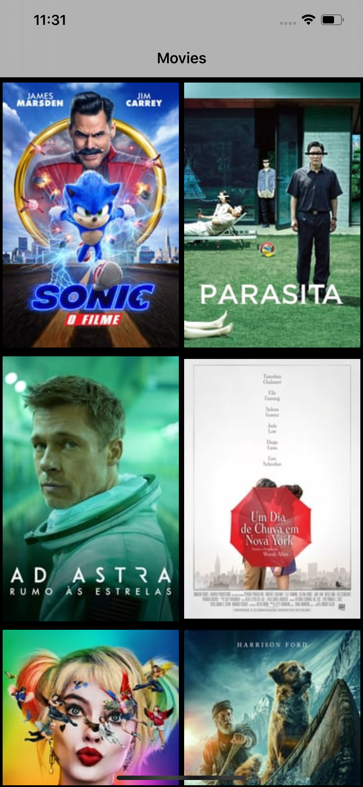
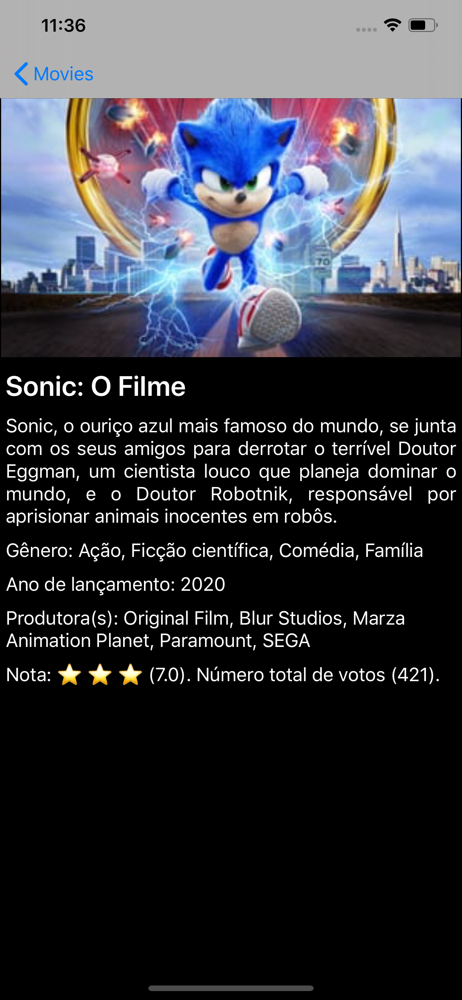

# Movies

An app that lists the movies from The Movie Database (TMDb) and shows the details of it.
This app uses the MVVM architecture.

  <a href="https://developers.themoviedb.org/3">TMDb API Docs</a>

Third-party libraries used:

<ul>
<li>Lottie</li>
</ul>

Lottie is a mobile library for Android and iOS that natively renders vector based animations and art in realtime with minimal code. It used to render the loading animation.

For install it. Open a terminal, go to the folder where podfile is. Run the command: pod install

